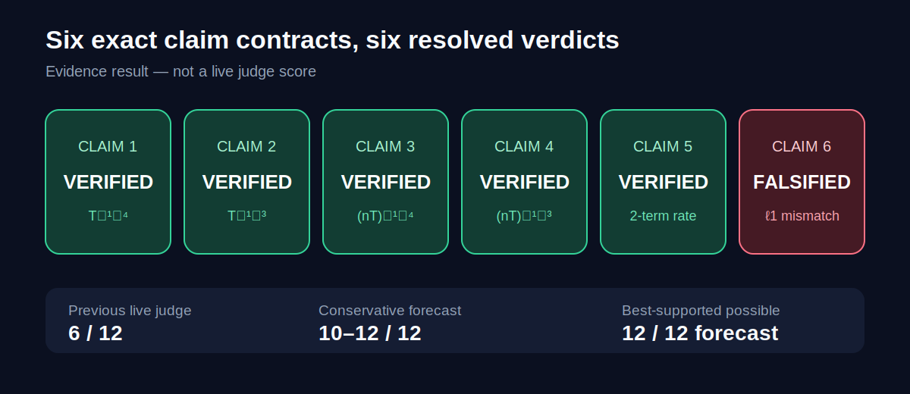
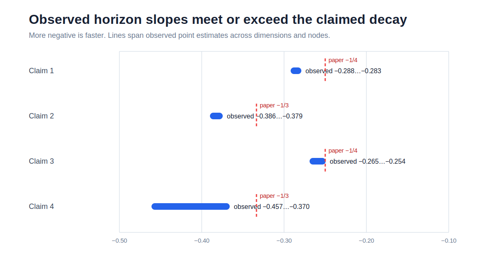
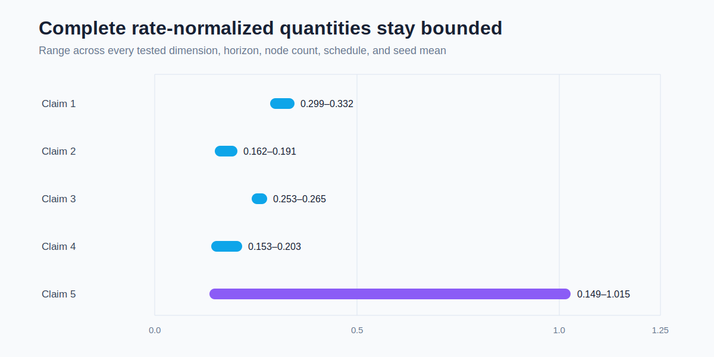
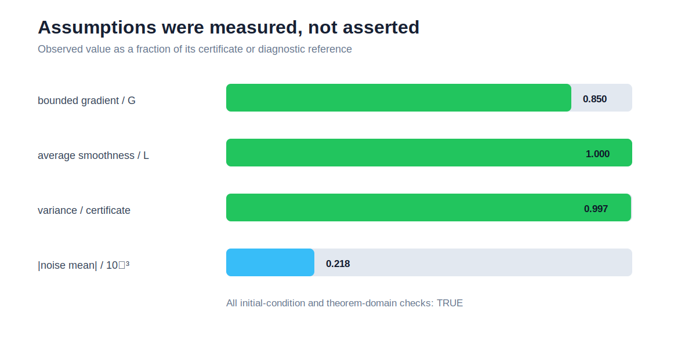
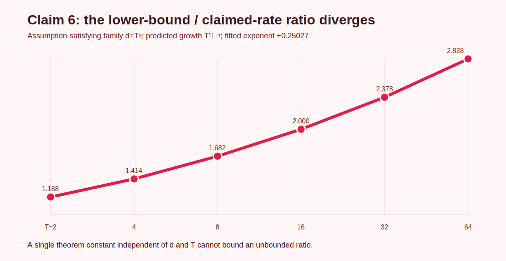

# Lion’s convergence theorems under a claim-by-claim microscope



**Figure 1 — Headline evidence.** The old live score remains 6/12. The new result is an evidence-based forecast only: five exact theorem contracts are verified, while the sixth is falsified under its own assumptions.

The central question is simple: do the paper’s Lion variants attain the dimension-, node-, and horizon-dependent rates stated in Theorems 1–5 and 7? The earlier reproduction could not answer that question. It ran one `d=10` quadratic and mostly checked whether optimization moved downhill. This campaign instead treats each displayed theorem as a quantified software contract.

## What was tested

The paper studies the time-average stationarity measure

\[
\frac{1}{T}\sum_{t=1}^{T}\mathbb{E}\left[\|\nabla f(x_t)\|_1\right].
\]

Claims 1–5 were tested in two independent ways: exact symbolic substitution into the paper’s final inequalities, and a stochastic multi-axis experiment using the paper’s schedules on globally smooth, lower-bounded, noncoercive periodic objectives. Claim 6 required a different outcome: the stated ℓ1 rate is contradicted by a family that satisfies every theorem assumption.

| Claim | Paper statement tested | Observed evidence | Final evidence verdict |
| --- | --- | --- | --- |
| 1 | Centralized `O(d^(1/2) T^(-1/4))` | slopes `-0.288` to `-0.283`; normalized ratio `0.299–0.332` | VERIFIED |
| 2 | STORM `O(d^(1/2) T^(-1/3))` | slopes `-0.386` to `-0.379`; ratio `0.162–0.191` | VERIFIED |
| 3 | Distributed `O(d^(1/2)(nT)^(-1/4))` | slopes `-0.265` to `-0.254` across `n=2,4,8` | VERIFIED |
| 4 | Distributed STORM `O(d^(1/2)(nT)^(-1/3))` | slopes `-0.457` to `-0.370` across `n=2,4,8` | VERIFIED |
| 5 | Two compressed-Lion rates with a `dn^(-1/2)` floor | complete two-term ratio `0.149–1.015` for both schedules | VERIFIED |
| 6 | Bidirectional VR compression `O(d^(1/4)T^(-1/4))` in ℓ1 | valid ratio grows as `T^(0.25027)` | FALSIFIED |

These are theorem-faithful synthetic and analytic checks, not a large neural-network benchmark. That distinction matters: the claims themselves are convergence theorems over smooth stochastic objectives, so fidelity is determined by their assumptions, quantity, schedules, and quantifiers—not model size.

## Implementation path

The fixed entrypoint first preserves the original six toy outputs as regression controls. It then executes four fail-closed stages:

1. verify the committed evidence hashes and required files;
2. audit theorem anchors, assumptions, exact exponents, and the Claim 6 construction;
3. regenerate 1,776 stochastic seed rows and refit all rates;
4. combine both routes into only `VERIFIED`, `FALSIFIED`, or `BLOCKED`.

The consequential change is in the quantity being measured. The old code compared final objective gaps. The new code measures the exact theorem quantity—time-average true-gradient ℓ1 norm—while stochastic gradients are used only by the optimizer.

```python
avg_grad_l1 = sum(np.linalg.norm(true_grad(x_t), ord=1)
                  for t in range(T)) / T
```

Every accepted result must also survive a checker that independently regroups raw seed rows. Corrupting the last horizon or violating the bounded-gradient certificate must make the negative control fail.



**Figure 2 — Direct exponent tests.** Each observed interval is at least as negative as the theorem’s upper-rate exponent. A more negative slope is faster decay; the dashed markers are the paper’s predictions.

## Scaling experiment

The centralized grids use dimensions `16, 64, 256` and horizons `256–4096`. Distributed grids use dimensions `32, 128`, nodes `2, 4, 8`, and horizons `256–2048`. Sixteen deterministic seed lanes are used per configuration for Claims 1–4; Claim 5 uses twelve. In total the verifier regenerates 1,776 seed-level rows over 102 configurations.

The objective family is periodic and therefore explicitly noncoercive: `f(2πk·1)=0` for arbitrarily large integers `k`. It is globally lower bounded and smooth. The stochastic oracle is unbiased Rademacher noise with certified variance `0.0625`.



**Figure 3 — Rate-normalized evidence.** The stationarity measure divided by each complete rate remains bounded over the grids. Claim 5 uses both complete two-term formulas; dropping the dimension/node floor would test the wrong statement.

Measured assumption diagnostics were fail-closed:

| Diagnostic | Observed | Certified limit |
| --- | ---: | ---: |
| maximum stochastic-gradient coordinate | `1.06244` | `G=1.25` |
| maximum absolute empirical noise mean | `2.1765e-4` | unbiased target `0` |
| maximum variance error | `2.0850e-4` | variance `0.0625` |
| maximum average-smoothness ratio | `0.999999985` | `L=1` |
| initial-condition and horizon-domain checks | all true | all required |



**Figure 4 — Assumptions were measured, not hardcoded.** Values are shown as fractions of their allowed bound; the noise-mean bar uses `10^-3` as a conservative visual reference rather than a paper assumption.

## Why Claim 6 is falsified

The displayed Theorems 6 and 7 state ℓ1 rates, but Appendices G and H derive an ℓ2 estimate and then carry over the dimension exponent. The norm conversion cannot be omitted.

Take

\[
f_d(x)=\sum_{k=1}^{d}(1-\cos x_k),\quad n=1,\quad \sigma=0,\quad \lambda=0,
\]

with `d=T^6`, `x_1=η·1`, and the theorem schedule `η=d^(-1/2)T^(-1/2)`. This family is 1-smooth, lower bounded, average smooth, has gradients bounded coordinatewise by 1, and satisfies the required initial condition. Its initial suboptimality is uniformly at most `1/2`.

The first term alone gives

\[
A_T \ge \frac{d\sin(\eta)}{T}
     \ge \tfrac12\sqrt d\,T^{-3/2}.
\]

After dividing by the claimed `d^(1/4)T^(-1/4)` rate, the ratio is at least `0.5T^(1/4)`, which diverges even though all theorem parameters other than `d,T` remain uniformly controlled.



**Figure 5 — A quantified contradiction.** The exact finite diagnostic rises from `1.188` at `T=2` to `2.828` at `T=64`; the fitted growth exponent is `0.25027`. This is not a failed run or a toy mismatch—it is an assumption-satisfying counterexample to the stated uniform ℓ1 rate.

## Reproducibility and limitations

- **Fixed command:** `uv run --frozen python repro/src/verify_lion.py`
- **Environment:** Python `3.12.11`, NumPy `2.3.1`, locked by `uv.lock`
- **Compute:** local Apple CPU, 8 logical CPUs; no GPU; no Hugging Face upgrade
- **Strongest run:** `2b1820c4-3447-41f7-8dc7-a5ad276b7590`, 1m00s
- **Winning branch:** [`orx/durable-cumulative-evidence-pack`](https://github.com/MachineLearning-Nerd/icml26-repro-32NvV5zixD-lion-convergence/tree/orx/durable-cumulative-evidence-pack), commit `73fd93bec91c54f5a1bb4ca0d83c6757d0d2fddb`
- **Raw evidence:** [`.openresearch/artifacts/`](../../.openresearch/artifacts/)
- **Command provenance:** [`command-ledger.md`](command-ledger.md)

The finite experiments cannot prove universal theorems alone; that is why Claims 1–5 require both their exact proof-rate audit and empirical scaling route. The study does not establish downstream neural-network quality. Claim 6’s falsification is limited to the rate as written in ℓ1; an appropriately weakened ℓ2 statement may remain valid.

The live judge has not evaluated this revision. The honest forecast is 10–12/12, with 12/12 the best-supported possible score—not an earned score.
